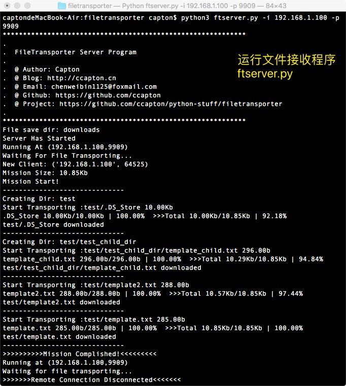
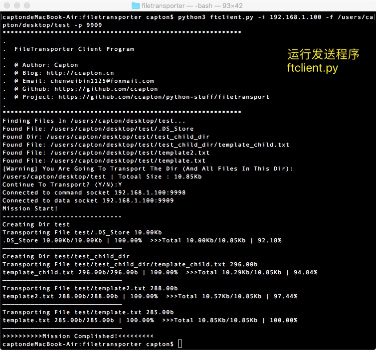
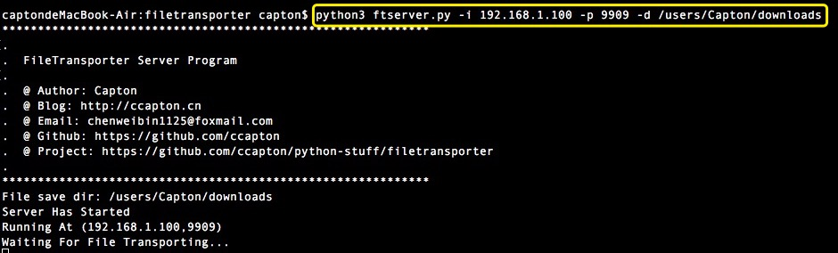
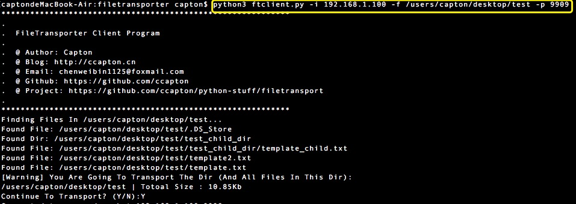

# FileTransporter

### 这是一个基于socket(TCP)的文件(夹)传输程序

### `预览效果`


##


### 一 、ftserver.py ：**接收端程序**
 
 * **基本用法**
```python
python3 ftserver.py 
```
默认主机地址：计算机本地ip （例如 '192.168.1.100'）,  默认下载目录： downloads,

默认工作端口：9997（传输文件数据）、9998（传输程序指令）

* **详细用法**  （带参数）
```html
-i 设置主机名称（地址）

-p 指定端口号

-d 指定文件（夹）保存路径 
```
**示例**

先用 cd 命令 切换到 ftserver.py 所在文件夹，然后：
```python
python3 ftserver.py -i 192.168.1.100 -p 9909 -d /users/Capton/downloads
```
**效果**
 


### 二 、ftclient.py ：**发送端程序**
 * **基本用法**
```python
python3 ftclient.py -i <主机名(ip)> -f <文件（夹）路径>
```
局域网内下，填目标主机名或本地ip
* **详细用法**  
```html
-i 设置接收方主机名称（地址），必要参数

-p 指定接收方服务端口号

-f 指定要发送的文件（夹）路径 ，必要参数
```
**示例**

先用 cd 命令 切换到 ftclient.py 所在文件夹，然后：
```python
python3 ftclient.py -i 192.168.1.100 -p 9909 -f /users/Capton/desktop/test
```
**效果**
 